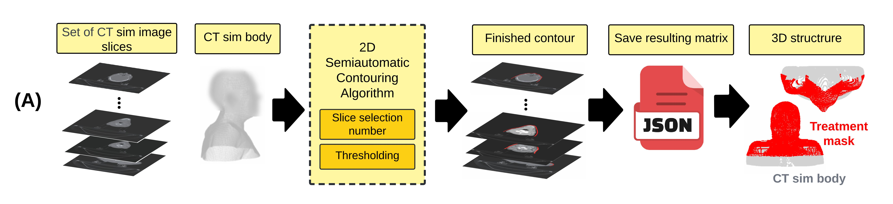

# HN-GeoNatomyX tool

## Table of Contents
[Authors](#Authors)  

## Authors
Odette Rios-Ibacache and James Manalad

Contact email: <a href="mailto:odette.riosibacache@mail.mcgill.ca">odette.riosibacache@mail.mcgill.ca</a>

Website: [www.kildealab.com](www.kildealab.com)
 
## Motivation
#### Quantification of head and neck cancer patients’ anatomy and longitudinal analysis and prediction of radiotherapy replanning need

Head and neck cancer patients undergoing radiotherapy may experience significant anatomical changes due to weight loss and tumor shrinkage. These changes can impact the effectiveness of the initial treatment plan, potentially necessitating treatment replanning. However, ad hoc replanning requires additional clinical staff time, which can lead to suboptimal and stressful treatment planning. Furthermore, currently, there is no established method for determining the total amount of anatomical variation in the head and neck region to decide whether replanning is necessary. This research aimed to identify and create metrics based on patient anatomical structures, that can describe the anatomical alterations that patients may experience throughout the treatment and influence decisions regarding treatment replanning. These parameters were used to develop a machine learning classification model to predict if patients would likely undergo replanning. Based on the 3D shape and 2D contours of structures, we defined 43 parameters. We developed **HN-GeoNatomyX**, an extraction pipeline to automatically calculate the defined 43 parameters over the course of the radiotherapy treatment.
## This repository contains:
  ### Semi-automatic contouring tool for the treatment mask
  
  ### Code for extracting the 43 parameters stored in scripts
  

#### Requirements
  *  [sys](https://docs.python.org/3/library/sys.html)
  *  [rtdsm](https://github.com/kildealab/rtdsm)
  *  [time](https://docs.python.org/3/library/time.html)
  *  [datetime](https://docs.python.org/3/library/datetime.html)
  *  [scipy](https://scipy.org/)
  *  [skimage](https://scikit-image.org/)
  *  [numpy](https://numpy.org/)
  *  [os](https://docs.python.org/3/library/os.html)
  *  [gc](https://docs.python.org/3/library/gc.html)
  *  [pyvista](https://docs.pyvista.org/)
  *  [alphashape](https://alphashape.readthedocs.io/en/latest/index.html)
  *  [pandas](https://pandas.pydata.org/)
  *  [pydicom](https://pydicom.github.io/pydicom/stable/)
  *  [sklearn](https://scikit-learn.org/stable/index.html)
  *  [shapely](https://shapely.readthedocs.io/en/stable/)
  *  [OpenCV](https://opencv.org/get-started/)
  *  [json](https://docs.python.org/3/library/json.html)

    
